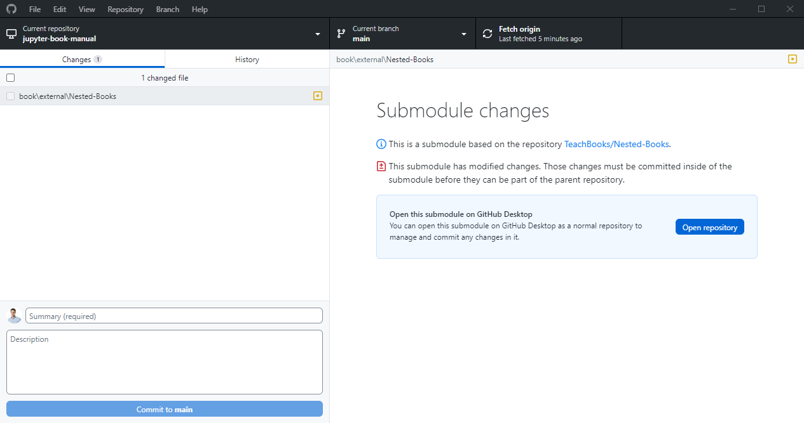

# Share content between books

## Adding to a new or existing book
If you want to add the repository of an external book to the repository of your parent book you can do so by using Git Submodules. This will basically nest the external repository in the parent repository, and it will appear as if we've manually copied the entire repository into the parent repository. I will use [this repository](https://github.com/TeachBooks/Nested-Books) as an example parent repository, and I'm going to add parts of an old [MUDE book](https://github.com/tudelft-citg/mude).

First, let's define the location where the external book should live. Good practise is to put it in `book/external` to highlight the fact that the content is in fact part of an external book. So the first step is to create the subdirectory `book/external/` in your repository. If you'd like to do that with the CLI you can do so as follows:

    mkdir -p book/external

Now we can add the external book in this folder. You'll need to use the CLI for that (open the CLI by opening Git Bash or click `Repository` - `Open in command prompt` in GitHub Desktop):

    cd book/external
    git submodule add <https-clone link to external book (https://github.com/tudelft-citg/mude.git for example)>

You can see that the `book/external` directory now contains a directory with the name of the external repository (`MUDE` or example), so the result is equivalent to simply running a `git clone` inside `book/external`. What is important to note here is that the contents of `book/external/<external repository>` are not part of the parent repository. Instead, `book/external/<external repository>` is a fully functional Git Repository itself. This means that you can make changes to the external book, from inside the parent book.

After the `git submodule` command, you can make a commit:

### Commit submodule using CLI
    git commit -m "Add external book"

### Commit submodule using GitHub Desktop:

GitHub Desktop will recognize that you've created a submodule:

For now, commit both `.gitmodules` and `book\external\<external repository>` to your parent repository.

Now, you can add sections of the external book to `_toc.yml`:

    chapters:
    - file: external/MUDE/book/intro.md

## Editing
If you want to make an edit to the content of an external repository which is a submodule of your parent repository, you'll need to make changes to the external repository first so that the parent repository has a commit to point to.

### ... using CLI

To be written

### ... using GitHub Desktop

First, make some changes in your external repository, which is stored locally within your parent repository. You might want to create a separate branch for this (on the external repository). If you've opened the external repository in GitHub desktop the workflow is not different than for normal non-nested repositories.

As soon as you've made the change, GitHub desktop shows you for the parent repository that there are changes in the external repository:

As you can see, it demands you to commit those changes in the external repository first. Let's do that (eventually by click `Open repository`) and eventually push your changes to the external's repository GitHub/GitLab as well.

Now, GitHub Desktop shows for the parent repository that that are changes in the submodule:

Commit this change to the parent repository, which will chang the commit to which it pins.

## Cloning
If you're cloning a repository that features submodules, the directories of the submodules will not be populated by default. To fix that, you need to do a recursive clone (i.e., clone the parent repository, as well as the submodules):

    git clone --recurse-submodules <link to parent repository>

## The external book is updated
When you add the external book as a submodule to your repository, Git will pin its version. When the external book is updated, you'll need to manually pull the updates to the parent book:

### ... using CLI
    git submodule update --remote

### ... using GitHub Desktop
First, pull changes for the external repository which is stored locally in your parent repository

Now, GitHub Desktop shows for the parent repository that that are changes in the submodule:

Commit this change to the parent repository, which will chang the commit to which it pins.

## Build book on GitLab/GitHub with submodule
If you're using a GitLab/GitHub workflow, make sure you force it to fetch al the submodules as well. If you're using the TeachBooks GitHub/GitLab workflow, that has been taken care of.

## More info
[Here](https://git-scm.com/book/en/v2/Git-Tools-Submodules) you can find more information on Git submodules.