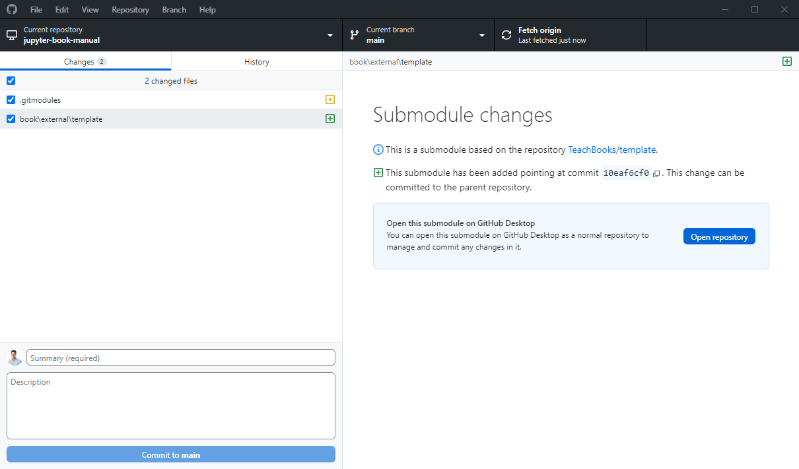
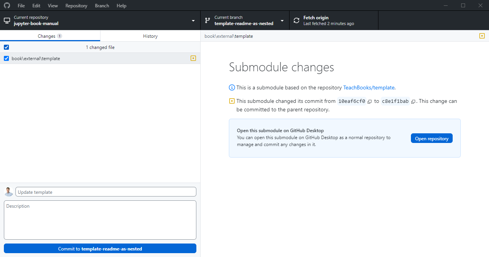

# Share content between books using submodules

```{attributiongrey} Attribution
:class: attribution
This page reuses CC BY 4.0 licensed content from {cite:t}`nested`. {fa}`quote-left`{ref}`Find out more here.<external_resources>`
```

```{admonition} User types
:class: tip
This section is useful for user type 4-5.
```

{bdg-dark}`Git Workflow`

When creating books, you might want to reuse material from other people or from other books you made. In some cases you might even want to have the exact same material into your book. You could do so by manually copying material over. However, whenever the source material is updated, you have to do that again. As an alternative, you can use the underlying git system to refer to the source file directly. This allows you to pick a specific version, or keep the most up-to-date version of it. This pages explains how to do so using 'git submodules'

```{tip}
This feature is now considered deprecated by the TeachBooks Development Team because we have developed an easier way to incorporate content from other source via the "external content" module in the `teachbooks` Python Package. You can find out more by visiting the [TeachBooks Manual](https://teachbooks.io/manual/features/external_toc.html) or [GitHub repository](https://github.com/teachbooks/teachbooks).
Note, however, that if you are comfortable with the steeper learning curve, the submodules feature of Git is still useful for some use cases, as it allows one to embed pages in a book which:
- include local images referenced with raw-HTML code and relative filepath references,
- refer to content in the `_static` folder of the other book (i.e., relative filepath references after book build),
- are part of a private book (private repository),
- _automatically_ notify you upon changes in the source book using Github's "Dependabot", mentioned below.

More generally, you should consider submodules if you want to have all of the files in a submodule book repository available in the main book repository (especially during and after the book build process); if you would like to  use the dependabot feature to automatically update your book every time a commit is made in the submodule repository; or, if you prefer to update content based on a specific commit hash rather than a tag or branch. In fact, submodules is how we keep the pages in this manual up to date for each of our TeachBooks Tools!
```

## Adding external content to your book

If you want to add the repository of an external book to the repository of your book you can do so by importing the other repository using Git Submodules. Your book is then called the parent book. This will basically nest the external repository in the parent repository, and it will appear as if we've manually copied the entire repository into the parent repository. I will use [this repository](https://github.com/TeachBooks/Nested-Books) as an example parent repository, and I'm going to add parts of an old [MUDE book](https://github.com/tudelft-citg/mude).

First, let's define the location where the external book should live. Good practice is to put it in `book/external` to highlight the fact that the content is in fact part of an external book. So the first step is to create the subdirectory `book/external/` in your repository. If you'd like to do that with the command line interface (CLI) you can do so as follows:

```
mkdir -p book/external
```

Now we can add the external book in this folder. You'll need to use the CLI for that! (open the CLI by opening Git Bash or click `Repository` - `Open in command prompt` in GitHub Desktop):

```
cd book/external
git submodule add -b <branch> <https-link>
```

where
- `<branch>` should be the branch you want of the external book/repository. If you only want the default branch, omit the part `-b <branch>` from the command.
- `<https-link>` is the link to the external book/repository,  for example `https://github.com/tudelft-citg/mude.git`.

You can see that the `book/external` directory now contains a directory with the name of the external repository (`MUDE` for example), so the result looks equivalent to simply running a `git clone` inside `book/external`, however what is important to note here is that the contents of `book/external/<external repository>` are not part of the parent repository. Instead, `book/external/<external repository>` is a fully functional Git Repository itself. This means that you can make changes to the external book, from inside the parent book.

If you did not add the submodule with an explicit branch, you can still do this by adding this to the `.submodules` file that has been created. In our example, we see the lines

```
[submodule "book/external/MUDE"]
	path = book/external/MUDE
	url = https://github.com/TUDelft-CITG/MUDE
```

Changes these to
```
[submodule "book/external/MUDE"]
	path = book/external/MUDE
	url = https://github.com/TUDelft-CITG/MUDE
        branch = <branch>
```
with again `<branch>` replaced by the preferred branch.

After the `git submodule` command, you can make a commit to your parent repositery:

`````{tab-set}
````{tab-item} ... using CLI
```
    git commit -m "Add external book"
```
````
````{tab-item} ... using GitHub Desktop

GitHub Desktop will recognize that you've created a submodule as indicated by `book/external/<external repository>`:



For now, commit both `.gitmodules` and `book\external\<external repository>` to your parent repository.

````
`````

Now, you can add sections of the external book to the table of contents of your parent book (`_toc.yml`):

```
chapters:
- file: external/MUDE/book/intro.md
```

In the above line, I have added the introduction of the MUDE book to my book.

You might want the title of your book page in the table of contents to be different than the title provided as the first header in your nested file. You can adapt the title by specifying it in `_toc.yml`:

```
- file: <somefile>
  title: <Some custom title to show in the table of contents>
```

## Editing

If you want to make an edit to the content of an external repository, which is a submodule of your parent repository (meaning it's nested), you'll need to make changes to the external repository so that the parent repository has a commit to point to when 'updating' its content. You can do this from within the parent repository! We'll break down the steps:

`````{tab-set}
````{tab-item} ... using CLI

**1. Navigate to the parent repository**

Open your terminal, for example Git Bash or the integrated terminal in VS Code and use the `cd` command followed by the full path of your parent repository that you have previously cloned to your laptop.

```
cd /<path>/<parent-repo>
```

Alternatively, you can locate the submodule in your files, hover your mouse above the path and `right click` - `copy adress as text`. Then you can paste the adress in between quotation marks. (This works only on windows)

```
cd "C:\<path>\<parent-repo>"
```

Once you are in the right folder, git bash will indicate the branch you are in in blue brackets.

**2. Update the submodule**

In case someone else has edited the content of the submodule you want to make sure that you ave pulled all recent changes.

```
git submodule update 
```

**3. Navigate to the submodule**

```
cd /<path>/<parent-repo>/external/<submodule>
```

Or 

```
cd "C:\<path>\<parent-repo>\external\<submodule>"
```

**4. Checkout a new branch (optional)**

It is good practice to create a new branch for every set of changes you make to the conent.

```
git checkout -b <new-branch>
```

**5. Make changes, stage, and commit them in the submodule**

Now you can make changes to your file. To open the file in VS Code type:

```
code <file-name.ext>
```

Save the file in VS Code and return to the terminal. To stage all changes type:

```
git add .
```

If you only want to stage one file type:

```
git add <file-name.ext>
```

Next commit the changes:

```
git commit -m "Commit message"
```

**6. Push the submodule changes to its remote repository**

Next you'll need to push the changes to the external repository. The syntax you need to follow to push is `<repository> <branch>`. The repository name will most likely be origin which refers to the cloned repository you are in.  

```
git push origin <branch-name>
```

**7. Return to the parent repository**

```
cd /<path>/<parent-repo>
```

Or

```
cd "C:\<path>\<parent-repo>"
```

**8. Stage the submodule update in the parent repo and commit**

Now we have to 'update' the parent repository with the changes pushed to the external repository (submodule).
First, stage the submodule update. Then commit the change.

```
git add book/external/<submodule>
git commit -m "Updated submodule"
```

**9. Push the parent repository changes**

Finally push the update to the remote repository. 

```
git push origin <branch-name>
```
    
````
````{tab-item} ... using GitHub Desktop

**1. Clarifications**

It is helpful to make the distinction between the external repository (as a 'freestanding' repository) and the nested external repository. In GitHub Desktop you can see the path by hovering above the cloned repository.

```{figure} figures/nested_external_2.png
---
width: 450
align: center
---
External Repository
```

```{figure} figures/nested_external_1.png
---
width: 450
align: center
---
Nested External Repository
```

From the path, you can see that the bottom `TeachBooks` repository is nested while the top one is not (the parent repository is jupyter-book-manual). We will call the nested repository the `external repository` from now on. In order to avoid confusion, you can give an 'alias' to the external repository by `Right Click` - `Create alias`.

```{figure} figures/alias.png
---
width: 450
align: center
---
Create Alias
```

Now that we have located the right folder `book/external/<external repository>` on GitHub Desktop, let's make some changes to your external repository (which is stored locally within your parent repository). You might want to create a separate branch in GitLab/GitHub on the external repository for this. The git workflow is not different than for normal non-nested repositories.

**2. Make some changes**

If you want to edit a document from the external book, you have do make changes to this document in the external repository but through the parent repository. How can you do this?

- On GitHub Desktop, open the **parent** repository
- On Vs Code, open the file you want to edit, it is located in the book/external/<external repository> folder
- Make some changes

As soon as you've made the change to a document, that lives in the external repository, through the parent repository, GitHub Desktop shows you in the parent repository that there are changes in the external repository (Submodule Changes):

```{figure} figures/submodule_change_first_commit.png
---
width: 700
align: center
---
Change in Submodule
```

**3. Commit to the external repository**

As you can see, GitHub desktop recognizes that there are changes in the nested external repository. You'll need to commit those to the external repository. Simply click on `Open Repository`. As you can see from the path by hovering above the current repository, the repository you 'cloned' is nested. Go ahead and give it an alias to keep an overview.

GitHub Desktop has automatically opened the external repository and all your changes are visible here. Make a new branch, commit to the new branch and push your changes to the external's repository GitHub/GitLab as well.

```{figure} figures/changes.png
---
width: 450
align: center
---
Changes
```

**4. Commit to the parent repository**

Now return to your parent repository. GitHub Desktop shows in the parent repository that there *have been* changes in the submodule, and that the parent repository is ready to be 'updated'. 

```{figure} figures/update_nested_repo.png
---
width: 700
align: center
---
Update nested repository
```

In particular, it says:

```{figure} figures/commit.png
---
width: 500
align: center
---
New Commit
```

Git uses these commit codes to know which version of the document to refer to. Commit this change to the parent repository, which will change the commit to which it pins. Finally, push your changes to GitLab/GitHub.
````

````{tab-item} ... using GitHub Dev with codespaces online

If you want to update the submodule online without cloning the repository, you can do so by using GitHub Dev with codespaces online. This example shows the Nested-Books repository as a external repository to the Manual as a parent repository.

**1. Open GitHub Dev with codespaces online**

On your GitHub repository, click `<> Code` - `Codespaces` - `Create codespace on main`

```{figure} figures/codespaces.png
---
width: 500
align: center
---
Codespaces
```

**2. Initiate submodule**

In a Bash terminal, add the command `git submodule init` and `git submodule update` to load and clone the external repositories as submodules:

```{figure} figures/submodule_init.png
---
width: 500
align: center
---
Initiate submodule 
```

This will clone all the files of the external books to the parent repository

**2. Make a change**

If you want to edit a document from the external book, you have do make changes to this document in the external repository. You can do so from the files within the parent repository you just cloned, or in the external book repo.

If you want to update a file directly within this parent repository, you can do so from within the codespace. Commit 

```{figure} figures/change_external.png
---
width: 500
align: center
---
Change external 
```

If you do it directly in the external book repo, you need to pull those updates in your codespace by clicking the branch and refresh:

```{figure} figures/refresh_external.png
---
width: 500
align: center
---
Refresh external repository 
```

**4. Commit to the parent repository**

As you can see, your codespaces recognizes that there are changes in the nested external repository:

```{figure} figures/update_parent.png
---
width: 500
align: center
---
Update parent repository
```

Commit this change to the parent repository, which will change the commit to which it pins. Finally, push/sync your changes.
````

`````

## Cloning with submodules

If you're cloning a repository that features submodules, the directories of the submodules will not be populated by default. To fix that, you need to do a recursive clone (i.e., clone the parent repository, as well as the submodules):

```
git clone --recurse-submodules <link to parent repository>
```

## The external book is updated

When you add the external book as a submodule to your repository, Git will pin its version. When the external book is updated, you'll need to manually pull the updates to the parent book or use the automatic GitHub Dependabot.

`````{tab-set}
````{tab-item} automatic using GitHub Dependabot
It is possible to set up Github in such a way that periodically and on demand the submodules in the _default_ branch of the parent repository. To enable this, perform the following steps:

1. Go to your repository on [Github](https://github.com/).
1. Choose **Settings**.
1. Choose **Code security**.
1. Choose **Enable** behind _Dependabot version updates_.
1. In opened file editor, edit the code to resemble below code and select "Commit changes..."

```yaml
# To get started with Dependabot version updates, you'll need to specify which
# package ecosystems to update and where the package manifests are located.
# Please see the documentation for all configuration options:
# https://docs.github.com/code-security/dependabot/dependabot-version-updates/configuration-options-for-the-dependabot.yml-file

version: 2
updates:
  - package-ecosystem: "gitsubmodule" # See documentation for possible values
    directory: "/" # Location of package manifests
    schedule:
      interval: "weekly"
      day: "sunday"
      time: "23:59"
```

This will check every sunday around midnight (UTC) whether any of the submodules have a newer commit in the preferred branch. If so, several things will happen:
1. A new branch starting with _dependabot_ will be created in the repository and any relevant workflows will be triggered.
1.  A _pull request_ will be created to pull the new branch into the _default_ branch. This pull request must be manually reviewed and merged. Afterwards the _dependabot_ branch can be deleted.

If the workflow `call-deploy-book` is used, and the _dependabot_ branch should not be built and deployed (and all other branches you do want),  you can achieve this by adding the next to the file `call-deploy-book.yml`:

```yaml
on:
  push:
    branches:
    - '**'
    - '!dependabot**'
```

If you want another scheduled workflow, see [Dependabot options reference](https://docs.github.com/en/code-security/dependabot/working-with-dependabot/dependabot-options-reference#schedule-) for the options.

If you want to manually trigger the Dependabot workflow, you can do this by doing the next steps:

1. Go to your repository on [Github](https://github.com/).
1. Choose **Insights**.
1. Choose **Dependency graph**.
1. Choose **Dependabot**.
1. Choose **Recent update jobs** next to <svg xmlns="http://www.w3.org/2000/svg" viewBox="0 0 16 16" fill="none" role="img" aria-labelledby="at3nhebt7uhg0dpjk0jboj3jpsarzidi" class="octicon" width="16" height="16"><title id="at3nhebt7uhg0dpjk0jboj3jpsarzidi">gitsubmodule</title><path d="M15.698 7.287L8.713.302a1.03 1.03 0 00-1.458 0l-1.45 1.45 1.84 1.84a1.223 1.223 0 011.55 1.56l1.773 1.774a1.226 1.226 0 11-.734.691L8.579 5.965v4.352a1.226 1.226 0 11-1.008-.036V5.888a1.226 1.226 0 01-.666-1.608L5.093 2.465l-4.79 4.79a1.03 1.03 0 000 1.458l6.986 6.985a1.03 1.03 0 001.457 0l6.953-6.953a1.03 1.03 0 000-1.458z" fill="#F05133"></path></svg>`.gitmodules`.
1. Choose **Check for updates**.

If you've private repositories, expand `.github/dependabot.yml` to:

```yaml
version: 2
registries:
  submodule1-registry:
    type: "git"
    url: https://github.com/
    username: x-access-token
    password: ${{secrets.GH_PAT}}
    
updates:
  - package-ecosystem: "gitsubmodule" # See documentation for possible values
    directory: "/" # Location of package manifests
    schedule:
      interval: "weekly"
      day: "sunday"
      time: "23:59"
    registries:
      - submodule1-registry
```

`GH_PAT` should be a a personal access token added to the repository action secrets with 'repo' scope. If you're making use of the deploy-book-workflow, this is the same personal access token as required for cloning the submodules in the [deploy-book-workflow](https://github.com/TeachBooks/deploy-book-workflow/tree/main?tab=readme-ov-file#private-submodules)

````

````{tab-item} manual using CLI
```
git submodule update --remote
```
````
````{tab-item} manual using GitHub Desktop

First, pull changes for the external repository (which is stored locally in your parent repository)

Now, GitHub Desktop shows for the parent repository that that are changes in the submodule:



Commit this change to the parent repository, which will chang the commit to which it pins.

````
`````

## Build book on GitLab/GitHub with submodule
If you're using a GitLab/GitHub workflow, make sure you force it to fetch all the submodules as well. If you're using the TeachBooks GitHub/GitLab workflow, that has been taken care of.

## Delete submodules
Deleting submodules is a bit notrocious... These steps [https://www.baeldung.com/ops/git-submodule-add-remove](https://www.baeldung.com/ops/git-submodule-add-remove) proved to be useful:

**1. Checkout to main**

`````{tab-set}
````{tab-item} ... using CLI
```
git checkout main
```
````
````{tab-item} ... using GitHub Desktop
Select main branch

````
`````

**2. Deinitialize submodule**    

```
git submodule deinit -f book/external/<external repository>
```

**3. Remove submodule Git directory**

Directly from file explorer or

```
rm -rf .git/modules/book/external/<external repository>
```

**4. Remove from `.gitmodules`**

Directly with text editor or:

```
git config -f .gitmodules --remove-section submodule.book/external/<external repository>
```

**5. Stage Changes to `.gitmodules`**

`````{tab-set}
````{tab-item} ... using CLI
```
git add .gitmodules
```
````
````{tab-item} ... using GitHub Desktop
Directly commit the change shown

````
`````


**6. Remove from Git cache**

```
git rm --cached book/external<external repository>
```

**7. Commit and push changes**

`````{tab-set}
````{tab-item} ... using CLI
```
git add .
git commit -m 'rm submodule: <external repository>'
git push
```
````
````{tab-item} ... using GitHub Desktop
Directly commit and push the changes shown
````
`````

**8. Delete repo and clone again**
For some reason the existence of the submodule is stored locally somewhere. To prevent further issues, you might want to delete the full parent repository and reclone it.

**9. Merge with other branches**
Merge this change with all other branches which still have this submodule.

## More info
[Here](https://git-scm.com/book/en/v2/Git-Tools-Submodules) you can find more information on Git submodules.

## Contribute
This tool's repository is stored on [GitHub](https://github.com/TeachBooks/Nested-Books). The `README.md` of the branch `manual-description` is also part of the [TeachBooks manual](https://teachbooks.io./manual/external/Nested-Books/README.html) as a submodule. If you'd like to contribute, you can create a fork and open a pull request on the [GitHub repository](https://github.com/TeachBooks/Nested-Books). To update the `README.md` shown in the TeachBooks manual, create a fork and open a merge request for the [GitHub repository of the manual](https://github.com/TeachBooks/manual). If you intent to clone the manual including its submodules, clone using: `git clone --recurse-submodulesgit@github.com:TeachBooks/manual.git`.
